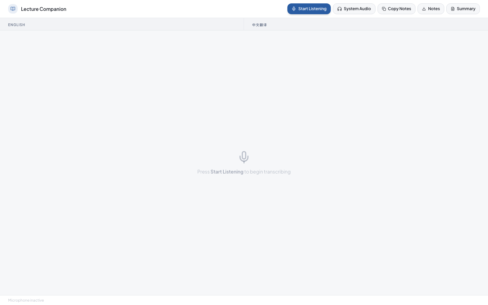

# Lecture Companion

An open-source AI lecture companion for international students.

Lecture Companion helps students follow fast English lectures in real time: it transcribes English speech in the browser, shows instant Simplified Chinese hints, records the lecture locally, upgrades finalized sentences with AI translation, and turns the transcript into copyable notes and a quick lecture summary.



## Why This Exists

Many international students can understand English, but lectures are harder: professors speak quickly, accents vary, sentences are fragmented, and normal translation tools are not designed for classroom flow. Lecture Companion is built around the real lecture experience: listen, translate, record, review, summarize.

## Features

- Live English transcription through the browser Speech Recognition API
- Instant Chinese keyword hints while the professor is still speaking
- Final AI translation for completed sentences through a small OpenAI-powered API
- Local lecture recording with downloadable WebM audio
- Copyable bilingual notes with timestamps
- Downloadable transcript notes
- Local extractive lecture summary
- Privacy-friendly default: recordings stay in the browser unless the user downloads them

## Current Limitations

- Best support is in Chrome and Edge. Safari support depends on the browser's Speech Recognition implementation.
- Browser Speech Recognition listens to the microphone. System audio capture is marked experimental because the Web Speech API does not reliably accept arbitrary captured audio streams.
- Live Chinese hints are dictionary-based and intentionally rough; final sentence translation is handled by the API.
- The included summary is local and extractive. A future version can add optional AI summaries.

## Project Structure

```text
lecture-companion/
  src/              React/Vite frontend
  server/           Express translation API
  docs/assets/      README images
```

## Quick Start

Install and run the frontend:

```bash
npm install
npm run dev
```

In another terminal, install and run the API server:

```bash
cd server
npm install
cp .env.example .env
npm run dev
```

Open `http://localhost:5173`.

## Environment Variables

Frontend:

```bash
VITE_API_PROXY_TARGET=http://localhost:8787
```

Server:

```bash
PORT=8787
OPENAI_API_KEY=your-api-key
OPENAI_MODEL=gpt-4o-mini
CORS_ORIGIN=http://localhost:5173
```

## Scripts

Frontend:

```bash
npm run dev
npm run typecheck
npm run build
```

Server:

```bash
cd server
npm run dev
npm run typecheck
npm run build
```

## Roadmap

- [ ] Optional AI lecture summary endpoint
- [ ] Better phrase glossary import/export
- [ ] Course-specific terminology profiles
- [ ] More robust sentence boundary detection for long lectures
- [ ] Better support for system audio through a dedicated transcription backend
- [ ] Demo video and benchmark clips
- [ ] One-click deployment guide

## Security And Privacy

- Do not commit `.env` files or API keys.
- The server reads `OPENAI_API_KEY` from environment variables only.
- Recordings are created in the browser and are not uploaded by this app.
- Be careful with real lecture recordings. You may need permission from your school, professor, or classmates before sharing recordings or transcripts.

## License

MIT
